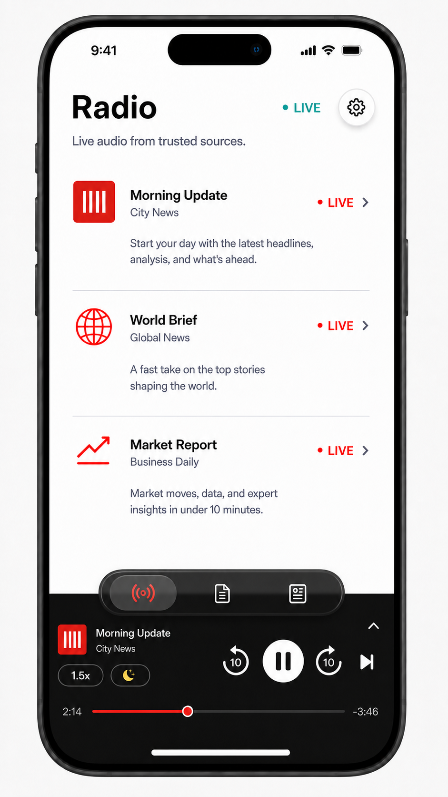

# Briefeed Live Radio MVP Design

**Date:** 2026-07-19  
**Status:** Implemented; focused simulator/archive verification passed; physical-device and packaged-credential distribution gates open

**Product focus:** Reliable, quick, lean-back news radio from RSS podcast audio  
**Relationship to existing PRD:** This specification governs the Live Radio vertical slice. It does not delete or redesign the Brief, Feed, Reddit, article summarization, or TTS systems. Where `PRD-REFACTOR-V2.md` describes Live News as a temporary non-persisted playback list, this specification supersedes that behavior for Radio playback.

## Product Intent

Briefeed should open into a useful audio experience even while Reddit ingestion and the future shared content backend remain unfinished. The primary launch experience is a Radio tab that plays current podcast news from configured sources such as NPR and BBC.

The experience is designed for short, repeated visits:

- With autoplay enabled, a cold launch begins or resumes Radio with minimal delay.
- Reopening the app during the same listening window does not restart completed episodes.
- A partially played episode resumes from its saved position.
- A user can press Next to continue immediately without marking the episode
  complete. Automatic hourly bulletins leave the current scan; daily and
  explicitly queued archive episodes remain resumable in the deferred tail.
- Refresh adds new episodes without replacing the current session or duplicating entries.
- The player remains understandable and controllable in the app, on the Lock Screen, and in Control Center.

The MVP should be independently useful without depending on Reddit discovery, article summarization, Gemini TTS, PocketTTS, Supabase, Render, or another server-side content pipeline.

## Approved Experience

The approved visual direction is stored at:



The required interaction hierarchy is:

1. Radio is the first and default app destination.
2. The bottom navigation is one compact, centered, icon-only glass rail with Radio, Brief, and Feed.
3. Settings is removed from the bottom navigation and opened from a top-right gear button.
4. A persistent black mini-player sits below the navigation rail when a Radio or Brief session exists.
5. Mini-player metadata, speed, and sleep controls occupy the left zone.
6. Back 10 seconds, play or pause, forward 10 seconds, and Next occupy an elevated right-aligned action zone.
7. The scrubber is thin, secondary, and draggable, with a larger invisible interaction area.
8. The mini-player has no waveform.
9. Tapping the upward chevron opens the expanded player.

The rendered chrome may be visually compact, but every interactive control must retain a minimum 44 by 44 point hit target.

## Scope

### In Scope

- Radio as the first tab and the primary launch surface.
- Opt-in cold-launch autoplay, disabled by default.
- A persisted Radio session independent of the Brief queue.
- Deterministic source ordering using the user's saved feed priority.
- Partial playback resume and completion tracking.
- Refresh and queue replenishment without duplicates.
- Manual Next behavior that does not lose partial progress.
- Playback speed from 0.5x through 4.0x, persisted as the last-used speed.
- Back and forward 10-second controls in the app and remote-command configuration.
- Next Episode in the mini-player and remote commands where iOS exposes it.
- A sleep timer with End of Episode, presets, and an exact custom duration.
- Background audio, interruptions, route changes, Now Playing metadata, Lock Screen, and Control Center behavior.
- Explicit empty, offline, stale, feed-failure, and playback-failure states.
- Unit, integration, UI, simulator, and physical-device verification.
- A thin Briefeed adapter over the shared simulator-fleet engine.
- A verified archive suitable for the next iOS distribution step.

### Preserved but Not Repaired by This Slice

- Brief queue and article playback.
- Feed browsing and article interactions.
- Existing RSS feed add, enable, delete, detail, and reorder operations.
- Article summarization and TTS code.
- Existing settings unrelated to Radio.

### Out of Scope

- Fixing Reddit ingestion.
- Supabase or Render content services.
- Mixing Radio episodes into the Brief queue automatically.
- User-authored episode playlists or arbitrary per-episode drag ordering.
- Guaranteed offline episode downloads.
- Background fetch while the app is suspended.
- CarPlay, widgets, and watchOS.
- On-device transcription, ad classification, smart ad skipping, or automatic ad skipping. That research remains isolated in GitHub issue #10.
- Irreversible TestFlight or App Store publication.

## Current-State Findings

The existing code contains useful foundations but does not satisfy the product behavior:

- `UnifiedAudioPlayer.liveNewsStreamQueue` is explicitly temporary and non-persisted.
- Live News marks an episode listened when playback starts rather than when playback completes.
- Live News progress is excluded from `QueueCoordinator` and is not saved to `RSSEpisode`.
- `RSSEpisode.lastPosition` is defined as a normalized 0 through 1 fraction, while Brief queue position is stored in seconds.
- `SwiftAudioExService` owns a second private URL queue and can auto-advance after notifying `UnifiedAudioPlayer`, creating double-advance risk.
- Cold-launch autoplay rebuilds one latest unlistened episode per feed instead of restoring a prior Radio session.
- Feed refresh is already persisted and deduplicated by `(guid, feedId)`, but multiple queue builders disagree about ordering.
- Two foreground refresh timers are registered.
- Background audio capability, spoken-audio session configuration, remote commands, Now Playing metadata, and interruption handling already exist.
- No sleep-timer domain state exists.
- The deployment target is iOS 18.2, while native Liquid Glass view APIs require an availability-gated iOS 26 path.

## Architecture Alternatives

### Option A: Separate Persisted Radio Session Coordinator - Recommended

Create a `RadioSessionCoordinator` as the single source of truth for Radio order, current episode, progress, autoplay, refresh reconciliation, error disposition, and sleep state. Store a lightweight Codable snapshot in UserDefaults and continue using Core Data for RSS feed and episode records. `UnifiedAudioPlayer` derives its Radio presentation from this coordinator and plays one URL at a time.

**Advantages**

- Keeps Radio independent of the broken article pipeline.
- Reuses existing RSS and audio foundations.
- Avoids a Core Data model migration for the first release.
- Makes restart restoration and deterministic reconciliation explicit.
- Closely mirrors the successful single-source pattern already used for Brief.

**Costs**

- Adds a second coordinator, intentionally scoped to a different playback product.
- Requires removing direct mutations of the temporary Live News queue.
- Requires a small event seam between the coordinator and `UnifiedAudioPlayer`.

### Option B: Extend QueueCoordinator to Own Radio and Brief

Add a second persisted queue or playback mode to `QueueCoordinator` and route Radio through it.

**Advantages**

- Fewer coordinator types.
- Some persistence helpers could be shared.

**Costs**

- Re-couples Radio to article and Brief queue semantics.
- Makes expiration, completion, retry, and navigation rules conditional throughout a foundational service.
- Increases regression risk in the already-complex article path.
- Conflicts with the goal that Radio remain independently shippable.

### Option C: Persist RadioSession and RadioQueueEntry as Core Data Entities

Create Core Data entities for sessions, ordered entries, seconds-based progress, failure state, and completion.

**Advantages**

- Strong relational persistence and queryability.
- Better long-term foundation for multiple playlists and history.

**Costs**

- Requires a model migration and migration tests before product behavior can be validated.
- The current persistence fallback can delete the store after selected migration failures.
- Adds complexity that the single-session MVP does not need.

### Decision

Use Option A. Add only small pure-value shared primitives where they reduce duplication. Do not move Radio into `QueueCoordinator`, and do not add new Core Data entities in this slice.

## Component Boundaries

### RadioSessionCoordinator

`RadioSessionCoordinator` is an `@MainActor` observable service and the only writer of Radio session state.

Responsibilities:

- Restore and validate the persisted Radio snapshot.
- Build the initial queue from Core Data episodes.
- Reconcile queue state after feed refresh.
- Persist current episode, order, per-entry position, and disposition.
- Decide which episode is next.
- Apply autoplay policy once per cold launch.
- Route play, pause, seek, skip, Next, completion, failure, and connectivity events.
- Own sleep-timer state and expiration behavior.
- Expose a stable read-only presentation state to view models.

It does not fetch or parse RSS itself, synthesize audio, own the Brief queue, or render UI.

### RadioQueueBuilder

`RadioQueueBuilder` is a pure type with no singleton or UI dependency.

Inputs:

- Enabled feeds and their priorities.
- Episodes grouped by feed.
- The validated prior snapshot.
- Current time.
- Freshness and retention policy.

Output:

- A deterministic ordered list of `RadioQueueEntry` values.
- A reconciliation report describing retained, appended, completed, expired, missing, disabled, and duplicate entries.

### RadioSessionStore

`RadioSessionStore` encodes and decodes `PersistedRadioSession` under a versioned UserDefaults key. Writes are debounced during progress updates and forced on pause, Next, completion, background transition, and termination notification. Every scheduled write captures a monotonically increasing generation. A forced save or clear increments the generation, cancels and invalidates the pending debounce, and writes synchronously before returning; an older callback must compare generations and may never overwrite newer forced state.

Corrupt or unsupported state fails closed by discarding only the Radio snapshot. It must never delete RSS Core Data or the Brief queue.

### RadioServiceContainer

`RadioServiceContainer` is the sole production composition root for Radio. Its lazy main-actor instance constructs and owns one connectivity monitor and one coordinator that receives that exact monitor; `UnifiedAudioPlayer` and the app lifecycle driver resolve their Radio dependencies from this container rather than from `RadioSessionCoordinator.shared`.

In DEBUG fixture mode, a process-local factory override may be installed only before the container is first resolved. App bootstrap clears fixture preferences, installs the fixture container factory, initializes isolated persistence/settings, and only then constructs playback view models. Attempting to install an override after resolution fails immediately. Production and hosted unit-test construction do not depend on fixture types.

### RSSAudioService

`RSSAudioService` remains the RSS fetch, parse, Core Data save, and source-management service.

Changes are limited to:

- One authoritative active-app refresh schedule.
- Stable episode identity and duplicate protection.
- A structured per-source refresh result instead of one overwritten `lastError`.
- A refresh completion event consumed by `RadioSessionCoordinator`.

### UnifiedAudioPlayer

`UnifiedAudioPlayer` remains the app-wide playback facade and the projection layer for Brief and Radio presentation.

For Radio:

- Its queue and index are read-only projections derived from `RadioSessionCoordinator`.
- It plays the coordinator-selected episode and seeks to the supplied seconds position.
- It forwards progress, completion, and playback errors to the coordinator.
- It never marks an episode listened at playback start.
- It never directly appends, removes, reorders, or resets Radio entries.

Brief behavior remains delegated to `QueueCoordinator`.

### SwiftAudioExService

`SwiftAudioExService` becomes a single-item transport adapter:

- Load and play exactly one URL.
- Pause, resume, stop, seek, and set rate.
- Publish player state, progress, completion, interruption, route, and remote-command events.
- Publish Now Playing metadata.

Each load creates a fresh underlying player and a fresh `TransportPlaybackID`. Listener closures capture that immutable ID; they never read a mutable current ID. The old player is stopped and detached before the replacement becomes active. The transport consumes the first failure or natural-end terminal event per ID and ignores later duplicates; an expected stop used for replacement is never reported as failure or completion.

AVAudioSession interruption and route callbacks publish identity-bound semantic events only. They do not pause or resume the player directly. `UnifiedAudioPlayer` routes them to the active coordinator, which persists first and decides whether to pause or resume.

Its private URL queue, index, `loadQueue`, `playNext`, `playPrevious`, and completion-time auto-advance are removed or made unreachable. High-level coordinators alone decide navigation.

### RadioPresentationModel

`AudioPlayerViewModelV2` may continue to expose the app-wide player API, but its Radio properties derive from `RadioSessionCoordinator`. Views never read Core Data directly to decide current Radio order.

## Persisted Data Model

The stored schema is versioned from its first release:

```swift
struct RadioEpisodeKey: Codable, Hashable {
    let feedID: String
    let episodeID: String
}

enum RadioEntryDisposition: String, Codable {
    case pending
    case playing
    case deferred
    case failedThisSession
}

struct RadioQueueEntry: Codable, Identifiable, Equatable {
    var id: RadioEpisodeKey { key }
    let key: RadioEpisodeKey
    var positionSeconds: TimeInterval
    var disposition: RadioEntryDisposition
    var playbackFailureCount: Int
    var lastPlaybackError: String?
}

struct PersistedRadioSession: Codable, Equatable {
    let schemaVersion: Int
    var entries: [RadioQueueEntry]
    var currentKey: RadioEpisodeKey?
    var savedAt: Date
}
```

UserDefaults key:

```text
briefeed_radio_session_v1
```

Core Data remains authoritative for:

- Feed identity, enablement, priority, and refresh metadata.
- Episode title, enclosure URL, publication date, duration, and source relation.
- `isListened` and `listenedDate` completion history.
- Existing normalized `lastPosition`, updated only when duration is known.

The snapshot remains authoritative for seconds-based resume position and Radio order. The implementation must not reinterpret legacy fractional `lastPosition` values as seconds.

## Stable Identity and Deduplication

The durable episode key is `(feedID, episodeID)`, not `episodeID` alone.

Within one refresh:

1. Prefer a non-empty RSS GUID as `episodeID`.
2. For identity only, canonicalize a valid HTTP or HTTPS enclosure URL with `URLComponents`: lowercase the scheme and host, remove the fragment and default port, preserve the normalized path, and sort query items by name then value. Playback always uses the publisher's original enclosure URL.
3. Represent publication time as an integer UTC epoch-second value.
4. If GUID is absent, require both a parseable publication date and a valid enclosure URL, then derive `episodeID` as the lowercase hexadecimal SHA-256 digest of `canonicalURL + "|" + epochSeconds`.
5. Reject an item that has neither a non-empty GUID nor both fallback components. Never substitute `Date()` for a missing or malformed publication date.
6. Before inserting a fallback-ID item, look up an existing episode from the same feed by canonical enclosure URL. If one exists, retain its durable ID and completion/progress state while updating safe metadata such as title and publication date. A publisher correcting `pubDate` must not create a second episode or replay completed content.

Within the active Radio session:

- Reject duplicate `RadioEpisodeKey` values.
- Reject a second entry with the same normalized enclosure URL, even if syndicated by another enabled feed.
- Preserve the first occurrence according to source priority.

Within each feed, sort candidates by publication date descending, then `episodeID` ascending. Across feeds, sort by `RSSFeed.priority` ascending, then `RSSFeed.id` ascending. These tie-breakers apply to initial construction and every reconciliation pass.

## Queue Ordering and Reconciliation

### Source Order

Enabled feeds are sorted by:

1. `RSSFeed.priority`, ascending.
2. Stable `RSSFeed.id`, ascending, as the deterministic tie-breaker.

The existing drag-to-reorder feed UI remains the user's MVP queue-order control.

### Initial Queue

When no valid snapshot exists:

1. For each enabled feed in source order, inspect its single newest published episode.
2. Hourly-source freshness is 2 hours.
3. Daily-source freshness is 24 hours.
4. Append that episode only when it is fresh, incomplete, and not a duplicate enclosure.
5. Do not backfill an older episode merely because the newest one was already completed.
6. Append at most one episode per source in the first pass.

If the snapshot is missing but a selected Core Data episode has a valid normalized `lastPosition` and known duration, initialize `positionSeconds` as `lastPosition * duration`. Never apply this conversion when duration is unknown.

This produces a short, source-balanced radio brief instead of allowing one feed to dominate.

### Restored Queue

When a snapshot exists:

1. Require the exact supported schema version. An unreadable snapshot or unsupported version discards only the Radio snapshot and starts from local Core Data.
2. Reject a snapshot containing more than 200 entries as corrupt.
3. Resolve each entry by exact `(feedID, episodeID)` and require a valid enclosure URL.
4. Keep the first occurrence of each key and normalized enclosure URL; drop later duplicates.
5. Drop entries whose feed or episode no longer exists, whose feed is disabled, that are completed, or that are beyond retention.
6. Repair a non-finite or negative position to `0`; when duration is known, clamp the position to `0...duration`.
7. Normalize every persisted `playing` disposition to paused readiness. On cold launch, normalize `failedThisSession` to `pending`, set `playbackFailureCount` to `0`, and clear `lastPlaybackError`.
8. Preserve the remaining entry order and repaired seconds position.
9. Preserve `currentKey` only when it resolves to exactly one eligible entry. Otherwise choose the first eligible entry deterministically; an empty session has a nil current key.
10. Append newly eligible episodes after the restored entries.

Entry-level defects are repaired or dropped individually. Only snapshot decoding failure, unsupported schema, or the 200-entry corruption guard discards the whole Radio snapshot.

The queue is never rebuilt from the beginning merely because a refresh returns no new items.

### Replenishment

After a successful or partially successful refresh:

- Keep the current entry and all still-eligible existing entries in their persisted order.
- Append new candidates in source priority order.
- Append no more than one new latest episode per source per reconciliation pass.
- Never insert a new episode ahead of the currently playing or paused episode.
- Never automatically replay an entry already completed.

### Source Reordering

Changing feed priority does not interrupt the current episode. It reorders only pending, never-started entries after the current entry. Deferred partial entries retain their relative position so a user pressing Next is not immediately returned to the same episode.

### Queue Partitions and Selection

The ordered snapshot is interpreted as four stable partitions:

1. The current entry, when present.
2. Pending, never-started entries sorted by feed priority, publication date descending, and episode key.
3. Deferred entries in their saved relative order.
4. `failedThisSession` entries in their saved relative order.

Reconciliation may reorder only the pending partition. Manual Next moves the current entry to the tail of the deferred partition. Automatic selection chooses the first pending entry, then the first deferred entry. Failed entries are ineligible until their failure budget is explicitly reset. If only failed entries remain, the session is `failed`, not `exhausted`.

## Playback Semantics

### Partial Episode

- Save position in seconds at least every 5 seconds while playing.
- Force a save on pause, seek completion, Next, background transition, route loss, interruption, and termination notification.
- On a cold launch with autoplay enabled, a remote automatic entry waits for the opening refresh. It resumes only if it remains the source's newest eligible entry after reconciliation; a newer source episode replaces it. Explicitly queued partial archive episodes retain their resume position.
- On a cold launch with autoplay disabled, restore it in a paused ready state.

### Manual Next

Manual Next means "continue without marking complete."

- Save the current seconds position.
- Remove an automatic hourly bulletin from this source scan so an old hour
  cannot replay after the other sources. Its progress remains in the archive.
- Change a daily or explicitly queued archive episode to `deferred` and move it
  behind all currently pending entries.
- Select and play the next eligible entry.
- If the session later cycles back to a retained deferred entry, resume it from
  the saved position.

### Completion

Mark an episode completed when either condition is true:

- The transport reports a successful natural end.
- The user leaves or advances after reaching at least 95 percent of a known duration.

Completion writes `isListened = true`, `listenedDate = now`, and normalized `lastPosition = 1.0`, then removes the entry from the Radio snapshot. A completed episode is never selected again automatically during its retention lifetime. An explicit user Replay action atomically clears those completion fields and progress before selecting the episode from the beginning; a failed reset leaves completion intact and does not start playback.

Completion must be crash-consistent. First update and successfully save the Core Data episode. Only after that save succeeds may the coordinator remove the Radio entry and persist the updated snapshot. If Core Data save fails, keep the entry and its position in the Radio session, pause automatic advancement, and expose a recoverable persistence error with Retry. Never remove an entry based only on an in-memory completion mutation. If the process dies after the Core Data save but before snapshot removal, restore treats Core Data completion as authoritative and drops the lingering snapshot entry, so it cannot replay.

### Previous Behavior

The mini-player does not include Previous. Back 10 seconds is the fast correction action. The expanded player may expose previous-session navigation only after the Radio coordinator can provide deterministic semantics; it is not required for the first usable build.

### Seeking

- Back and forward actions use exactly 10 seconds.
- Clamp seeks to `0...duration` when duration is known.
- The scrubber accepts taps and drags across a 44-point interaction lane even though the visible rail is thin.
- VoiceOver exposes the scrubber as adjustable, announces elapsed and remaining time, and changes in useful increments.

### Playback Speed

- Supported values are `0.5, 0.75, 1.0, 1.25, 1.5, 1.75, 2.0, 2.5, 3.0, 3.5, 4.0`.
- Persist the last-used value for both Radio and Brief playback under the canonical `playbackSpeed` UserDefaults key.
- When `playbackSpeed` is absent, migrate `rssPlaybackSpeed` once, write the normalized value to `playbackSpeed`, and stop reading the legacy key.
- Normalize a non-finite saved value to `1.0`; otherwise clamp to `0.5...4.0` and choose the nearest supported value, resolving an exact tie toward the lower value.
- Remote-command supported rates match the same list.

### Remote Commands and Now Playing Ownership

- `SwiftAudioExService` is the sole registrar for `MPRemoteCommandCenter` and the sole publisher of low-level transport events.
- `UnifiedAudioPlayer` is the sole semantic router from those events to the active Brief or Radio coordinator.
- Play, pause, seek, 10-second skip, rate change, and Next are always routed through the active playback mode; no remote callback mutates a second private queue.
- Radio Previous is disabled. Next is enabled only when the Radio coordinator reports a pending or deferred eligible entry.
- Preferred forward and backward intervals are both exactly 10 seconds.
- Supported remote playback rates are exactly the canonical in-app speed list.
- Command enablement and Now Playing metadata are refreshed after every current-item, playback-state, queue-eligibility, route, and mode transition.

## Autoplay and Lifecycle State Machine

### States

```text
idle
restoring
refreshing
readyPaused
loading
playing
pausedByUser
waitingForNetwork
noSources
exhausted
failed
```

Sleep state is orthogonal:

```text
off
deadline(Date)
endOfEpisode
```

`sourceDegraded` is an orthogonal diagnostic flag derived from non-empty per-source failures. It may coexist with `playing`, `readyPaused`, or another primary session state and must never replace active playback as the primary state. Radio Home does not render this diagnostic as a banner; Radio Sources marks only each affected source row.

### Cold Launch

1. Load user settings and Core Data.
2. Run local-only `ensureDefaultFeedsExist`; it inserts missing default feed rows but performs no network request.
3. Restore and reconcile the Radio snapshot using local data only.
4. If autoplay is enabled and the restored entry is a readable local file, it may start immediately without network access.
5. Otherwise keep the one autoplay opportunity pending and, once connectivity resolves online, force-refresh every enabled source even when its last-success timestamp is inside the periodic stale window.
6. Reconcile the source-centric queue after the opening refresh, replacing an older automatic source slot with that source's newest eligible episode.
7. If autoplay remains eligible, start the reconciled current episode only after that refresh; never start a persisted remote episode first and refresh behind it.
8. If no local entry exists, show an updating/checking-connection state while connectivity or refresh is unresolved.
9. Resolve an empty session using the state precedence defined below; do not assume it is exhausted.

Autoplay is off by default and is exposed as a clear Radio setting. Preserve the existing canonical `autoPlayLiveNewsOnOpen` UserDefaults key while renaming its visible setting to Radio autoplay. It runs once per process cold launch, not every time the scene becomes active or the Radio tab appears. For remote content, the one cold-launch opportunity remains pending for at most 60 seconds while the app stays active, through the first connectivity-resolved forced opening refresh. It expires at the deadline, on inactive/background transition, or on any user-initiated playback command. A qualifying initial refresh may start the reconciled current episode whether it was newly inserted or already stored; that refresh or a terminal empty result consumes the opportunity. Later foreground, poll, and manual refreshes never autoplay.

### Foreground Return

- If audio is playing, continue playing.
- If the user paused, remain paused.
- Do not invoke autoplay again.
- Force one enabled-source refresh on the foreground return, and reconcile without interrupting active audio or invoking autoplay.
- Idempotently establish exactly one 15-minute active poll. A background-to-foreground cycle re-arms one canceled poll and never leaves zero or creates two.

### Background Transition

- Persist the snapshot immediately.
- Cancel any pending deferred cold-launch autoplay opportunity.
- Continue active audio under the existing background-audio mode.
- Re-arm one best-effort `BGAppRefreshTask` request, but do not start a feed request merely because the app entered background.
- Continue evaluating an armed sleep deadline while audio remains active.

### Interruption and Route Change

- Pause on interruption start.
- Resume after interruption only when iOS supplies `shouldResume` and the user had not paused first.
- Pause when headphones or an external route are removed.
- Persist position before changing playback state.

## Refresh, Failure, Offline, and Empty Behavior

### Feed Refresh Failure

- Each source produces an independent success or failure result.
- A fresh source that requires no request reports `skippedFresh(lastSuccessfulRefresh:)`; it counts as successful-source evidence because it proves a prior successful refresh. A source without a prior successful timestamp cannot report `skippedFresh`.
- Failure of one source does not fail the whole refresh.
- Existing queued entries from that source remain playable.
- The Radio screen shows a source-level retry affordance and last-success context.
- Successful sources can still replenish the queue.

### Refresh Cadence and Staleness

- Hourly sources become stale 30 minutes after their last successful refresh.
- Daily sources become stale 6 hours after their last successful refresh.
- On cold launch and every foreground return, force one enabled-source refresh so opening the app cannot trust a recently checked feed that published just afterward.
- Reopening Radio Home after at least 60 seconds since the last forced opening request also forces one enabled-source refresh. SwiftUI remounts inside that debounce do not duplicate work.
- While the app remains active, one authoritative 15-minute poll invokes only `refreshIfStale`; it does not force a network request for fresh sources. Entering background cancels it, and the next foreground re-arms exactly one poll.
- Register one `BGAppRefreshTask` under `<bundle-id>.radio-refresh`, request an earliest begin date 45 minutes later, and re-arm it when it launches or the app backgrounds. It invokes only `refreshIfStale`, never autoplay or transport. This is opportunistic because iOS controls execution time; it cannot replace the deterministic opening refresh.
- Manual Refresh ignores the stale threshold.
- Remove the duplicate app and RSS-service refresh timers and update `RSSFeed.isStale` and `checkInterval` to use this single policy.

### Episode Playback Failure

- `ConnectivityMonitoring` is the injectable connectivity interface. `RadioNetworkMonitor`, backed by `NWPathMonitor`, is the production implementation.
- Connectivity begins as `unknown`, not optimistically online. While unknown, readable local files may play, but remote refresh and remote enclosure loads wait and consume no attempt. The first online or offline path update resolves the pending action. With no local entry, `unknown` presents the nonterminal refreshing/checking-connection state and can never resolve to exhausted.
- Each episode receives one initial online load and one online retry per failure cycle.
- Going offline consumes no attempt. Connectivity restoration uses the remaining attempt budget.
- Only an explicit Retry action, a successful refresh for that episode's source, or a cold launch resets the failure cycle. A failed manual refresh does not reset it.
- If online, retry opening the current stream once after a short delay.
- After the retry fails, preserve its position, mark it `failedThisSession`, and advance.
- Do not mark it completed.
- Do not retry the same failed entry again during the same uninterrupted queue pass.
- A successful manual source refresh or later cold launch normalizes affected `failedThisSession` entries back to `pending`, clears their transient error count, and allows one new bounded attempt.
- If every remaining entry fails, stop in `failed` with a clear Retry action.

### Offline

- Do not run a feed refresh while offline.
- Allow currently buffered playback to continue.
- Prefer `downloadedFilePath` when it exists and points to a readable file.
- If the selected episode requires the network, save position and transition to `waitingForNetwork` without advancing or marking complete.
- When connectivity returns, retry the same selected episode once, then resume normal failure handling.
- Guaranteed episode downloading is not part of this MVP.

### Stale and Missed Episodes

- A newly built session considers only fresh candidates: 2 hours for hourly sources and 24 hours for daily sources.
- A persisted, already-selected episode remains eligible through retention: 24 hours for hourly sources and 7 days for daily sources.
- A partial episode beyond retention is removed from the Radio session and is not auto-resumed.
- Older unplayed episodes that were never in the persisted session are not backfilled automatically.

### Empty Queue

Empty-state precedence is evaluated in this exact order:

1. Existing active or buffered playback remains the primary state; source failures appear as `sourceDegraded` without interrupting it.
2. No enabled feeds produces `noSources` with a Manage Sources action.
3. No playable entry while offline produces `waitingForNetwork`.
4. No playable entry while any refresh is active produces `refreshing`.
5. No playable entry after every attempted source failed produces `failed`.
6. `exhausted` is allowed only after at least one enabled source refresh succeeded or returned `skippedFresh(lastSuccessfulRefresh:)`, and produced no eligible episode.

Only in the final case:

- Stop automatic advancement.
- Show `You're caught up` in the player.
- Keep Refresh available.
- Keep autoplay preference unchanged.
- Do not loop completed episodes or rebuild from the first source.

## Sleep Timer

The moon control opens a compact menu containing:

- Off
- End of Episode
- 10 minutes
- 20 minutes
- 30 minutes
- 45 minutes
- 60 minutes
- Custom

Custom duration uses an exact minute stepper from 1 through 180 minutes, initialized to 20 minutes. A slider is not used for the final exact value because it makes single-minute selection unnecessarily imprecise.

Behavior:

- Setting a duration replaces any existing timer atomically.
- The mini-player shows remaining time in the sleep control's accessibility value and compact visible state.
- At a deadline, pause playback once, persist position, and clear the timer.
- Deadline expiration never marks the episode complete.
- End of Episode allows the current episode to finish, suppresses auto-advance, persists the next cursor, and pauses.
- If the user presses Next while End of Episode is armed, cancel that timer, defer the current episode normally, and start the next eligible episode. The timer does not carry forward unless the user sets it again.
- Canceling the timer has no playback side effect.
- The timer survives ordinary foreground/background transitions by storing an in-memory deadline and checking it on progress and lifecycle events.
- The timer does not survive process termination or a new cold launch.

## Navigation and Player UI

### Root Navigation

Introduce:

```swift
enum AppTab: Hashable {
    case radio
    case brief
    case feed
}
```

`ContentView` owns the selected `AppTab`, defaulting to `.radio`, and mounts only the selected root through a `switch`. Do not retain hidden Radio, Brief, and Feed trees: high-frequency audio publications can otherwise invalidate all three roots and exceed iOS CPU limits. Durable playback and queue state lives in shared coordinators and services; root-local presentation state may reset when switching tabs. Do not use a native `TabView`: its system tab bar can reappear on iOS 26 even when hidden and duplicate the custom rail. Place the custom lower chrome after the flexible root content in the vertical layout rather than overlaying it or using a fixed offset. This gives the list a hard visible boundary above the chrome.

The lower chrome is isolated in a small host view that observes player state. Playback time exposed to SwiftUI updates at most once per displayed second. Radio session entry publications and debounced durable progress writes occur at five-second boundaries, while pause, seek completion, Next, background, interruption, route loss, and termination force-save the exact position. Source-archive episode candidates are derived only after navigation into an archive, not while every Radio Home row is rendered.

The lower chrome order is:

```text
RadioTabRail
MiniAudioPlayerV4
system safe area / home indicator
```

The mini-player is the phone-bottom surface, not a floating card above the home
indicator. Its material continues through the bottom safe area, its content
stays clear of the indicator, and only its top corners are rounded. The rail has
an opaque or sufficiently solid semantic backing so scrolling playlist text is
never legible through it.

### RadioTabRail

- One centered glass capsule.
- Three icon-only controls: Radio, Brief, Feed.
- Selected Radio uses the app's restrained red accent and a soft inner selection lozenge.
- No visible text labels.
- VoiceOver labels are `Radio`, `Brief`, and `Feed`.
- The selected item has the selected accessibility trait.
- The rail remains stable across active and inactive player states.

### Glass Availability

- iOS 26 and later: use `GlassEffectContainer` and native glass effects where they preserve the approved proportions.
- iOS 18.2 through 25: use a smoky adaptive material, fine highlight, and restrained shadow.
- Reduce Transparency: use an opaque high-contrast semantic surface.
- Increase Contrast: strengthen symbol and boundary contrast.
- Reduce Motion: use a short cross-fade for selection rather than a spring translation.

Glass is reserved for navigation and the Settings button, not used throughout feed content.

### Settings

Remove Settings as a tab. A top-right gear presents the existing `SettingsView` as a full-height sheet from Radio, Brief, and Feed. Radio-specific settings are grouped at the top of its Audio section:

- Autoplay Radio on cold launch, default Off.
- Playback speed, reflecting the shared last-used value.
- Feed order and enablement link.

When refresh succeeds only partially, the affected source row in Radio Sources
shows an orange warning icon with an accessible error description. Radio Home
continues with available episodes and shows no global partial-refresh banner.

Normal source administration does not occupy Radio Home. Add Source remains a
direct Radio recovery action only when no enabled source can populate the
playlist.

### Radio Home Playlist

- Radio Home is a plain, vertically descending playlist rather than a stack of
  status cards.
- Show exactly one automatic row per source, ordered by user source priority.
  The row represents the newest fetched episode for that source. A newer hourly
  bulletin replaces an older automatic slot; the brief never schedules both
  hours consecutively merely because both remain in Core Data.
- Do not interrupt an actively playing or user-paused older episode when a
  refresh finds a replacement. Finish or skip that episode, then continue to
  the next source. The replacement remains available in the source archive.
- Manual Next never records completion. For an automatic hourly bulletin it
  persists a retired entry so relaunching cannot re-add that same edition; the
  retired entry is discarded when a newer edition for that source arrives.
  Daily and manually queued archive episodes instead move to the deferred tail
  and retain their saved position.
- Each row shows title, source, relative publication time, archive availability,
  and one of: Ready, Up next, percent listened, Listened, Latest update, or
  unavailable for this session.
- Each row has two explicit 44-point-or-larger actions. The leading icon and
  title region is the primary Play, Pause, Resume, Replay, or Retry action. The
  separate trailing chevron is the only source-archive navigation target.
  Never use a checkmark in the primary action position or make an invisible
  whole-row navigation rule compete with playback.
- A completed newest episode remains visible as a muted, non-playing Listened
  source row even though it is absent from the eligible playback queue. Its
  explicit Replay action resets completion and starts it from the beginning.
- Hourly title-only dates are normalized into `Source: local time · local date`
  using the user's current time zone. Known networks use compact identities:
  `NPR`, `ABC`, `CBS`, and `CBC`. Editorial daily episode titles remain
  unchanged, with publication timing subordinate in metadata.
- Selecting the trailing chevron opens a descending source archive. Retained prior
  episodes offer Play Now and Play Later. Explicit Play Later entries are
  persisted manual queue exceptions and may coexist with the source's automatic
  latest slot; automatic reconciliation itself never creates that duplication.
- Normal playing, paused, and loading states are represented by the row and
  mini-player. Separate state content is reserved for restoration, refresh,
  offline recovery, no sources, exhausted, and failure.
- The scroll viewport ends above the navigation rail and mini-player. A source
  row may not paint underneath either surface, including during a bottom scroll.

### Mini Player

The mini-player remains compact and uses the approved asymmetric layout:

- Upper left: episode artwork, one-line title, and source inside one accessible
  44-point target.
- Right: Back 10, dominant Play or Pause, Forward 10, Next.
- Bottom: speed and sleep on the left, then elapsed time, thin draggable
  scrubber, and remaining time in the same 44-point row.
- Secondary upward chevron opens the expanded player.

It appears whenever Radio or Brief has a current or resumable session. On the Radio tab with an exhausted session, it remains in a compact stopped state with `You're caught up` and Refresh available.

Cold-launch Radio restoration begins only after the first observed active scene.
A transient launch `.inactive` phase is not treated as backgrounding and must
not consume the single configured autoplay opportunity. Once an active scene
has been observed, later inactive/background transitions retain the existing
save-and-cancel behavior.

### Expanded Player

The expanded player continues as a sheet. For this slice it must:

- Use 10-second back and forward intervals.
- Use the same 0.5x through 4.0x speed source.
- Expose the same sleep timer.
- Display the Radio source and current session position.
- Avoid presenting the Brief queue as though it were the active Radio queue.

## Accessibility and Layout

- Use semantic text styles and Dynamic Type instead of fixed point sizes for user-facing text.
- Use `@ScaledMetric` for icon and spacing adjustments that must scale.
- Maintain 44 by 44 point hit areas for all controls.
- Give the scrubber an adjustable accessibility role, value, and increment/decrement behavior.
- Announce play/pause, speed, sleep, and queue-exhausted state changes without excessive live-region chatter.
- Keep the right transport cluster stable when titles, times, or speed values change.
- Truncate metadata before compressing transport controls.
- Validate small iPhone, large iPhone, iPad landscape, default Dynamic Type, XXXL, and accessibility sizes.
- Respect safe areas, keyboard presentation, Reduce Motion, Reduce Transparency, Increase Contrast, and Dark Mode.

## Simulator Fleet and Test Runbook

Briefeed must use the shared simulator-fleet engine at `/Users/me/ericode/skills/app-testing` through a thin repo-owned adapter. It must not copy or reimplement the fleet.

Create:

```text
Briefeed/skills/app-testing/
  SKILL.md
  config.sh
  scripts/build-install.sh
  scripts/radio-fixtures.sh
  scripts/run-radio.sh
  scripts/radio-smoke.sh
```

The single lane entry command is:

```bash
bash Briefeed/skills/app-testing/scripts/run-radio.sh <lane-key> <unit|ui|smoke>
```

`run-radio.sh` exports an absolute `AGENT_SIM_CONFIG`, acquires a per-lane adapter lock before claim resolution or cloning, runs the shared `sim-doctor.sh --gc` before allocation, and uses `sim-golden.sh clone <lane-key>` only when the exact lane has no valid recorded device. It reads the lane claim at `~/.local/state/briefeed-agent-simulators/<lane-key>.env`, verifies that recorded `SIM_UUID` exists, recorded `SIM_NAME` equals the device's actual name and has the fleet prefix, `sim_claims_for_uuid` returns exactly that one claim file, and the UUID is not protected. It then acquires `sim_use_lock "$SIM_UUID" "$$" "briefeed-<mode>-<lane-key>"` and runs all `xcodebuild`, `simctl install`, launch, log, screenshot, and UI commands with `platform=iOS Simulator,id=$SIM_UUID` or the exact UUID argument.

An `EXIT` trap touches the recorded lane's lease while the per-device use lock is still held, then releases the device lock and per-lane adapter lock. In accordance with the current shared-engine contract, the adapter leaves its owned simulator booted for warm reuse; the engine's lease-aware garbage collector later shuts down or deletes stale devices. The adapter never runs broad shutdown, erase, or delete commands. A malformed or multiply-owned claim, name mismatch, fleet-prefix mismatch, protected UUID, live use lock, full fleet, critical host pressure, or clone exit `75` is a routing or capacity failure and exits `75` without running product tests.

Adapter rules:

- `AGENT_SIM_PREFIX=Briefeed-Codex`.
- Bundle ID is `Matznerd.Briefeed`.
- Every lane receives a distinct key such as `radio-unit`, `radio-ui`, or `radio-manual`.
- All automated lanes remain headless.
- Never select the first available iPhone.
- Never use the protected human simulator.
- Never shut down or erase a simulator the lane did not create.
- Use the exact lane's recorded UUID, the shared per-device lock, bounded waits, and lane-specific fixed DerivedData paths under `/tmp/briefeed-radio-<lane-key>-derived-data`.
- Exit 75 means capacity or routing failure, not a product test failure.
- Run simulator-free compile and analysis gates before claiming a simulator.
- Release the simulator's use lock promptly after a lane finishes, touch its lease, and leave the owned device booted for warm reuse.

### Deterministic Fixtures

Radio tests must not depend on live publisher feeds. The fixture service provides:

- Three feeds with deterministic priorities.
- Fresh, partial, completed, stale, malformed, duplicate-GUID, and duplicate-enclosure episodes.
- Small local audio files long enough to verify time advancement, seeking, completion, and transition latency.
- Success, delayed response, HTTP failure, invalid media, and offline conditions.
- Launch arguments that disable automatic production startup and select an isolated test store.

The DEBUG fixture definition supplies initial connectivity and scripted post-restore coordinator actions for partial, completed, offline, refreshing, all-failed, degraded, no-sources, and exhausted states. It injects a fixture connectivity monitor before coordinator construction and drives only public production transition methods; no scenario reaches a publisher feed or assigns coordinator internals directly.

Fixture reset is deliberately narrow. Reset deletes only the isolated `Briefeed-RadioUITests.sqlite` store and its WAL/SHM, removes `briefeed_radio_session_v1`, `playbackSpeed`, `rssPlaybackSpeed`, `autoPlayLiveNewsOnOpen`, and `rssLastPlayedEpisodeId`, then establishes autoplay Off and speed `1.0`. It never clears the whole defaults domain. Preference reset runs during app bootstrap before any settings, session-store, persistence, view-model, or coordinator singleton is initialized; the current eager `BriefeedApp` stored-property initializers are removed and initialized in the body only after preflight. Core Data reset then occurs inside the isolated persistence-controller initialization. A launch without reset preserves the isolated store and those values so relaunch tests exercise real restoration. One cross-scenario test reuses a claimed lane and proves reset prevents state bleed while no-reset preserves the active scenario.

## Verification Strategy

### Pure Unit Tests

- Initial queue order and stable tie-breaking.
- Restore and reconciliation without reordering existing entries.
- Freshness and retention boundaries.
- Partial resume and manual-Next deferral.
- Completion removal and same-hour no-replay behavior.
- Disabled and deleted feed removal.
- Duplicate GUID and duplicate enclosure handling.
- Refresh append without duplicate or current-item replacement.
- Bounded playback failure and offline transitions.
- Autoplay cold-launch-only policy.
- Sleep schedule, replacement, cancellation, deadline, and End of Episode.
- Speed clamping and persistence.

### Hosted Integration Tests

- Core Data episode round-trip with exact `(feedID, episodeID)` lookup.
- Persisted Radio snapshot restoration across a new coordinator instance.
- Progress saved in seconds without corrupting normalized Core Data progress.
- One low-level completion event produces exactly one coordinator advance.
- Natural completion versus manual Next semantics.
- Brief queue and position remain unchanged during Radio playback.
- Refresh during active playback preserves the current item.

### XCUITests

- App launches into Radio.
- Icon-only rail switches Radio, Brief, and Feed while preserving state.
- Settings opens and dismisses from each primary section.
- Autoplay Off remains silent; autoplay On begins fixture audio on cold relaunch.
- Mini-player play, pause, back 10, forward 10, Next, speed, sleep, scrubber, and expanded-player presentation.
- Empty, refreshing, offline, source-failure, and caught-up states.
- Relaunch restores partial progress and does not replay completed content.
- Accessibility labels and selected traits for icon-only navigation.

### Headless Simulator Smoke

- Build and install into an owned clone.
- Seed deterministic feeds and local audio.
- Launch Radio, start playback, and prove time advances.
- Exercise Back 10, Forward 10, Next, pause, and resume.
- Relaunch and prove restored item and position.
- Capture bounded logs, UI hierarchy, screenshots, and the `.xcresult` path.

### Physical Device Gate

Simulator success is insufficient for:

- Audible playback quality.
- Screen-lock background continuation.
- Lock Screen and Control Center command layout.
- Bluetooth, AirPlay, headphone removal, and route changes.
- Phone-call and Siri interruptions.
- Network loss and recovery while streaming.
- Sleep timer expiration while locked.
- Real power, thermal, and buffering behavior.

These checks are mandatory before distribution-candidate signoff.

## Shortest Sequence to a Usable Build

1. Add deterministic Radio unit fixtures and the repo-owned simulator adapter.
2. Add the persisted Radio snapshot, store, pure queue builder, and coordinator tests.
3. Route existing Live News playback through the coordinator and remove low-level queue auto-navigation.
4. Correct seconds progress, partial resume, completion, Next deferral, and refresh reconciliation.
5. Add cold-launch autoplay, lifecycle persistence, offline state, and bounded failure handling.
6. Implement the approved Radio-first navigation and mini-player layout with accessibility and iOS 18.2 fallback.
7. Add speed normalization, remote 10-second commands, and the sleep timer.
8. Run unit, integration, XCUITest, headless simulator, and physical-device gates.
9. Produce and validate a fresh signed archive.

Each step must leave a testable app and must preserve Brief and Feed behavior.

## Distribution Boundary

Deployment means producing a verified build suitable for the next distribution action. It does not mean automatically publishing the app.

Automation may:

- Resolve packages.
- Build, analyze, test, archive, and export when signing is available.
- Inspect bundle identity, version, entitlements, packaged resources, and archive validity.
- Prepare release notes and a TestFlight checklist.

A green unsigned generic build is implementation evidence only. The build may be called a distribution candidate only after the physical-device checklist passes and a fresh signed archive/export is validated. If device access, signing, provisioning, or export configuration is unavailable, the receipt must say `implementation verified; distribution candidate blocked` and leave the release gate open.

The release audit must treat API values substituted into the application
`Info.plist` as extractable public client configuration. A privileged Firecrawl
credential must never ship in the client: move that access behind an
authenticated server-owned endpoint and rotate/revoke the packaged value. A
Gemini client credential may remain only after an explicit trust decision plus
provider-enforced API, app-identity, quota, and abuse restrictions; otherwise
it also moves server-side. A distribution archive must pass an automated gate
that rejects forbidden or nonempty privileged credentials. GitHub #16 blocks
public sharing, TestFlight, and App Store upload until these conditions are met.

Human-only actions include:

- Creating the missing App Store Connect record for `Matznerd.Briefeed`.
- Confirming agreements, roles, certificates, profiles, privacy answers, and export compliance.
- Approving the final signed archive and version/build numbers.
- Explicitly initiating upload.
- Selecting tester groups and submitting external beta review or App Review.

GitHub issue #7 remains the current App Store Connect blocker. Historical `/tmp` IPA and archive paths are not release evidence for this build and must be regenerated.

## Acceptance Criteria

The Live Radio MVP is ready for a distribution candidate when all of the following are true:

- A fresh install opens to Radio.
- Autoplay is disabled by default and can be enabled in Settings.
- Enabled autoplay runs on cold launch only.
- A partial episode resumes at the saved position after process recreation.
- A completed episode is not replayed after reopening in the same hour.
- Manual Next preserves partial progress and advances to the next eligible
  source; automatic hourly updates do not recur later in the same scan.
- Feed priority deterministically controls source order.
- Refresh retains current and queued entries, appends new eligible entries, and creates no duplicates.
- Failed sources do not block successful sources.
- Offline state preserves session and position without falsely completing or skipping an episode.
- Exhaustion shows `You're caught up` and does not loop.
- Mini and expanded players use Back 10 and Forward 10.
- Playback speed remains within 0.5x through 4.0x and persists across launch.
- Sleep presets, exact custom duration, cancel, deadline, and End of Episode work while foregrounded and while locked on device.
- Brief queue items, Brief index, and Brief position are unchanged by Radio playback.
- Lock Screen and Control Center show accurate metadata and working play/pause, 10-second skip controls where iOS exposes them, and Next.
- The custom navigation is accessible, safe-area correct, and usable with Dynamic Type and reduced-transparency settings.
- All focused automated gates pass using deterministic fixtures and owned simulator lanes.
- The physical-device checklist passes.
- A newly inspected archive contains no privileged Firecrawl credential and
  satisfies the documented Gemini trust decision and packaging gate.
- A fresh archive is validated and the remaining human-only App Store Connect actions are identified.

## Evidence Map

Key current implementation surfaces:

- `Briefeed/Briefeed/ContentView.swift`
- `Briefeed/Briefeed/BriefeedApp.swift`
- `Briefeed/Briefeed/BriefeedApp+RSSV2.swift`
- `Briefeed/Briefeed/Core/Services/RSS/RSSAudioService.swift`
- `Briefeed/Briefeed/Core/Models/RSS/RSSEpisode+CoreDataClass.swift`
- `Briefeed/Briefeed/Core/Models/RSS/RSSEpisode+CoreDataProperties.swift`
- `Briefeed/Briefeed/Core/Services/Audio/UnifiedAudioPlayer.swift`
- `Briefeed/Briefeed/Core/Services/Audio/SwiftAudioExService.swift`
- `Briefeed/Briefeed/Core/ViewModels/AudioPlayerViewModelV2.swift`
- `Briefeed/Briefeed/Features/LiveNews/LiveNewsViewV2.swift`
- `Briefeed/Briefeed/Features/Audio/MiniAudioPlayerV4.swift`
- `Briefeed/Briefeed/Features/Audio/ExpandedAudioPlayerV2.swift`
- `Briefeed/Briefeed/Features/Settings/SettingsView.swift`
- `Briefeed/Briefeed/Info.plist`
- `Briefeed/docs/PRD-REFACTOR-V2.md`
- `Briefeed/docs/handoff/pockettts-testflight-handoff.md`
